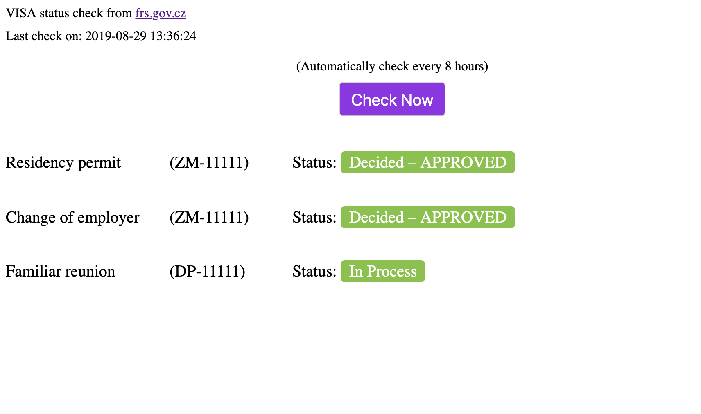

# auto-check-cz-visa

This app comes ups while I'm waiting for my VISA applications in Czech Republic. The status on this process can be check by the Czech Minister page. But I decided to do it automatically every 4hours and check my 3 application in one row. This app will send a desktop notifications if there is a change in the status.

## Configure 

Edit the python script `check.py` whit your personal codes, those you get them after the Visa application. 

```python
# your personal codes goes here:
visaCodes = ({
    'number': 1111, # your number of application
    'code': 'ZM', # your code of application
    'desc': 'Residency permit' # Here put whatever you want to see in the FrontEnd
}, {
    'number': 1111,
    'code': 'ZM',
    'desc': 'Change of employer'
}, {
    'number': 1111,
    'code': 'DP',
    'desc': 'Familiar reunion'
})
```


## Install & Run

```shell
npm install && npm start
```

## Preview

Go to `http://localhost:3000/` in you browser. (Tested in chrome)



### Dev notes

- Backend is a small express app with a websocket implementation the backend request the data of the minister page throw a python script `check.py`
- The FontEnd it's just HTML/CSS & vanilla JS in EMACS 5.1 (I wanted to remember old times)

Have in mind that this app was done in a few hours. But the main part is the python script which one I wrote in 30 mins. You can just run it in a terminal and it will print the status: `python check.py`
_____

<p align="center">
  <a href="https://github.com/labs-js/turbo-git/blob/develop/README.md"></a>
</p>